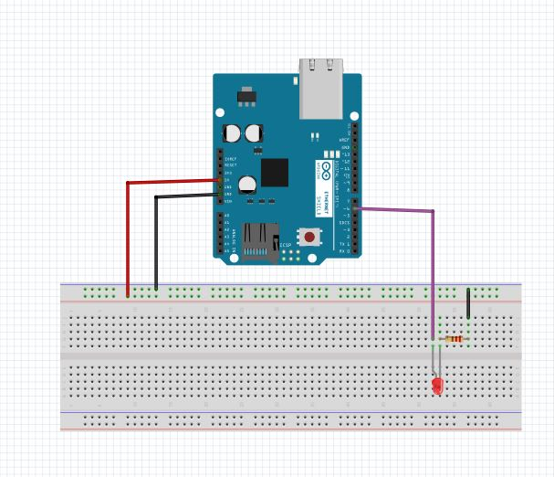
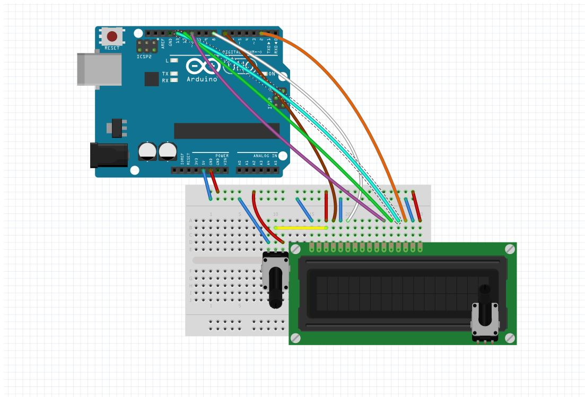
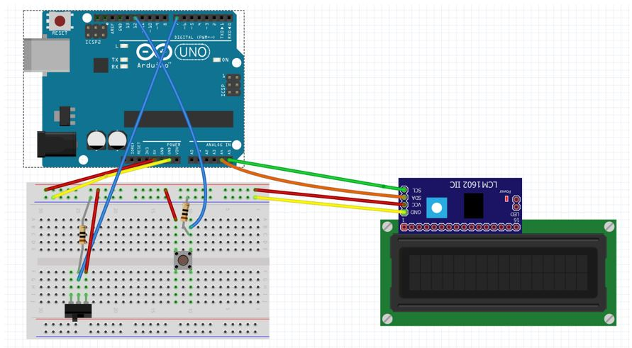
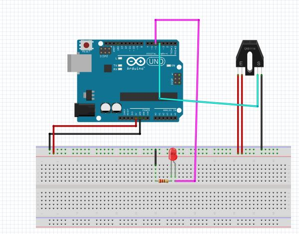

# Intermediate_Arduino
Assignments: New Ping, LCD, Continuous Rotation Servo, LCD backpack, Photo Interuptor, Potentiometer, Ultrasonic Sensor.

## LED blink revisited
 
What it does: Makes an LED fade in and out, using a function.

What I learned: How to create an increasing and decreasing function and apply it to an LED. I also learned how to use analogWrite and further extended my use of variables. 

Struggles: It was hard for me to get comfortable not using the digitalWrite command, but overall this assignment was straightforward.

Code:  https://github.com/vcraghe32/Intermediate_Arduino/tree/master/LED_blink_revisited.ino 

Wiring:

## Hello LCD

What it does: Prints out "Hello world" on the first line of the LCD and prints out the time in seconds on the second line of the LCD.

What I learned: How to set up an lcd screen and print out letters and integers on it.

Struggles: It was hard to figure out how to wire the lcd and use new code for it. I had a bad lcd board so I had to switch it out.

Code:  https://github.com/vcraghe32/Intermediate_Arduino/tree/master/lcdbackpack

Wiring:

Credit: Paul B. CHS Sigma Wiki

## LCD backpack

What it does: Uses an LCD backpack to control the brightness of the LCD, and simplify LCD wiring.

What I learned: How to code and wire the LCD backpack.

Struggles: I had complications with my backpacks and my LCD screens, so I had to switch them out. 

Code:  https://github.com/vcraghe32/Intermediate_Arduino/tree/master/lcdbackpack

Wiring:

Credit: Paul B. CHS sigma wiki
## Photointerrupters

What it does: Turns on the LED when something is between the two sides of the photointerrupter.

What I learned: How to control the power going to the LED using a phtointerrupter, and wire a photointerrupter.

Struggles: I had to figure out how to use a boolean for the function, and how to use variables to my advantage.

Code:  https://github.com/vcraghe32/Intermediate_Arduino/tree/master/photoversion1.ino

Wiring:

## Potentiometers

What it does: Uses a potentiometer to control the variable printed out on the LCD screen.

What I learned: How to measure a potentiometer and use it to control the LCD.

Struggles: This assignment wasn't very difficult, but the wiring was a little hard.

Code:  https://github.com/vcraghe32/Intermediate_Arduino/tree/master/potentiovi.ino

## New Ping

What it does: Uses New Ping to replace the distance function that we created in the first ultrasonic sensor project, and when you press a button the serial monitor shows the distance of an object away from the sensor.

What I learned: How to download an addition to sublime and use it in my code.

Struggles: It look a while for me to figure out how to download the New Ping addition to my computer, because it was glitching.

Code:  https://github.com/vcraghe32/Intermediate_Arduino/tree/master/newpingvi2originalgetdist.ino

## Motor Control

What it does: Controls the speed and direction of a motor based on the turn of the potentiometer.

What I learned: How to wire a diode and transistor and control a DC motor using a potentiometer.

Struggles: I had a bad potentiometer and transistor, and the wiring was challenging. The code was fairly simple.

Code:  

